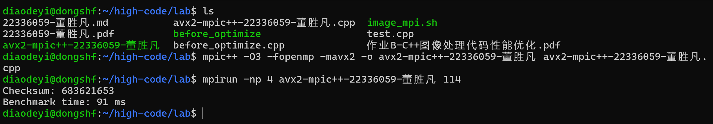

## <center>体系结构（2024 秋）- 大作业2
#### <center>November 29, 2024


### 运行说明
代码的运行环境是Windows下的linux子系统（wsl），我编写了一个shell脚本*image_mpi.sh*，封装了全部的编译指令

<font color=blue>代码同时实现了OpenMPI进程并行和OpenMP线程并行，个人PC经过测试，使用4进程8线程性能最佳，测试时请根据实际情况进行调整。

进程数设置在shell脚本 mpirun 中指定，线程数在源代码第8行宏定义THREAD_COUNT指定</font>
```sh
#!/bin/bash
#
mpic++ -O0 -fopenmp -mavx -o avx2-mpic++-22336059-董胜凡 avx2-mpic++-22336059-董胜凡.cpp
echo "Please enter the value of the seed:"

while true; do
    read seed

    # 检查输入是否合法
    if [[ "$seed" =~ ^[1-9][0-9]*|0$ ]]; then
        echo "Using seed: $seed"
        break
    else
        echo "Invalid input. Please enter a positive integer."
    fi

done
mpirun -np 4 avx2-mpic++-22336059-董胜凡 $seed
```

### 优化思路
**在下面的讨论中，记figure和result为矩阵A、B。**
#### 1、数据结构
由于在原代码中没有使用到任何vector方法，C++对vector的封装完全变成了性能的拖累，在优化过程中使用unsigned char*的原始数组取代vector。

二维数组在内存中的布局结构是，每一行在内存中连续分布，但行与行之间是不连续的。在result的更新中，访问figure上下左右邻居元素时，并不满足空间局部性。我使用一维数组来模拟二维矩阵，解决了这一问题。

#### 2、查找表的构建
在函数powerLawTransformation中，对result数组的每次更新都需要计算一个幂次
$$B_{ij} = 255 \times \sqrt{\frac{A_{ij}}{255}} + 0.5$$
然而由于result数组的每个元素均在0到255之间，我们可以提前计算出一个256大小的查找表，这样每次更新的时候只需要查表即可，无需计算。

#### 3、使用OpenMPI进行进程级并行
由于figure矩阵和result矩阵为16384大小的矩阵，且数据依赖性不强，因此尝试使用OpenMPI进行并行，具体思路如下

将矩阵A、B按行分块，记分块后为local_A和loacl_B，通过MPI_Scatter将分割后的矩阵广播给4个进程。

<font color=blue>这里出现的问题是在函数gaussianFilter中，矩阵local_B的更新需要local_A的上下左右共8个邻居的值，因此在local_B的边界处，每个进程会出现访问越界的情况。</font>

我的解决方案是每个进程在首尾额外开辟两行作为缓冲区，一共开辟$\frac{16384}{4}+2=4098$行，在计算之前，调用MPI_Sendrecv进行点对点通信，同时避免进程死锁，向邻居进程发送自己的临界行，这样在local_B的边界便可以正常更新。

#### 4、使用OpenMP进行线程级并行

在函数powerLawTransformation和gaussianFilter中，外层循环i不存在数据依赖，执行先后顺序对最终结果无影响，直接在外层循环i前面加上
```c++
#pragma omp parallel for num_threads(THREAD_COUNT)
```
即可。

#### 5、使用SIMD向量集

在函数gaussianFilter中，我们需要对res数组进行高斯模糊处理，数组中的每个元素为8位的unsigned char。如果用__m256i加载32个unsigned char数据到AVX寄存器中，在迭代过程中需要对AVX向量中的每个8位数据进行左移右移处理。

然而在AVX指令集中，srli函数的最小粒度是16位，没有针对8位unsigned char进行右移的函数。需要将8位数据事先扩展为16位，然后载入AVX寄存器，使用函数_mm256_srli_epi16进行右移，计算结果再压缩为8位，存储到res数组中。


### 实现过程

**<font color=red>由于篇幅限制，代码见压缩包内cpp文件</font>**

#### 1、宏定义、函数和全局变量的声明

THREAD_COUNT宏控制OpenMP一共开辟多少线程，在个人PC环境中，通过测试，开启8线程性能最佳。

initialize函数的作用是给figure和result分配空间，同时使用随机数生成器填充figure数组

gaussianFilter和powerLawTransformation与原代码不同，该处修改成OpenMPI的进程并行版本，传入参数rank和size标记进程的编号和总数，每个进程运行不同的逻辑。
```c++
using std::vector;
#define THREAD_COUNT 8


unsigned char* figure;
unsigned char* result;

void initialize(size_t N, size_t seed = 0);

void gaussianFilter(unsigned char* fig, unsigned char* res, int rows_per_proc, size_t N, 
                    int rank, int size, MPI_Comm comm);

void powerLawTransformation(unsigned char* fig, unsigned char* res, int rows_per_proc, size_t N, unsigned char* LUT);

void runBenchmark(int rank, int size, size_t N);
```
#### 2、gaussianFilter函数的实现
代码如下，这是本程序实现最复杂的一部分。

函数参数中的fig和res均为局部数组（每个进程从根进程获取）

像优化思路部分中提到的一样，每个进程额外开辟两行作为缓冲区，与上下邻居进行交换临界行。<font color=blue>使用MPI_Sendrecv函数可以有效防止死锁（如果使用普通的send和recv函数可能出现每个进程都等待其他进程向自己发送消息的情形）。</font>

下面一行是OpenMP的线程并行接口，num_threads(THREAD_COUNT)子句保证一共开启 THREAD_COUNT 个线程。

两层for循环，每个进程执行属于自己的一部分数组的更新，这一部分需要注意边界的处理：

（1）迭代过程中数组边界元素的特殊处理

（2）使用SIMD向量集时16无法整除一行元素（去掉首尾）的情形。


#### 3、powerLawTransformation函数的实现

该函数的实现比较简单，只要对res数组的每个元素查询事先建立好的LUT即可。该函数本人通过AVX向量集实现，使用__m256i，每次可以加载32个unsigned char类型的数据。

32可以整除16384，因此不需要对边界进行讨论。


#### 4、runBenchmark函数的实现
具体实现在代码中均有注释。

关于计时，除了正常的初始化，我没有计算构建查找表和广播初始条件MPI_Scatter的时间。

（1）MPI_Scatter函数将初始的figure矩阵广播到4个进程，由于经过一次广播，两个函数gaussianFilter和powerLawTransformation均可以使用广播的结果，因此单纯将分发的时间算入到任何一个函数都是不合理的。

（2）和随机初始化16384*16384的figure矩阵所花的时间相比，LUT和广播初始条件的运行时间微不足道。

<font color=blue>
计算运行时间的部分为

（1）每个进程运行gaussianFilter的时间

（2）每个进程运行powerLawTransformation的时间

（3）运行完毕后，使用MPI_Gather汇总到根进程的时间
</font>


### 优化效果
**CPU型号为Intel(R) Core(TM) Ultra 9 185H**
**为了校验运行结果正确与否，测试使用种子 114**


原代码运行时间 10023 ms，开启编译优化-O3后运行时间 2570 ms
优化后的代码未开启编译优化，运行时间 177 ms
**加速比**
$$ \frac{10023}{177} = 56.63$$

优化后的代码开启编译优化-O3后，运行时间为 91 ms
